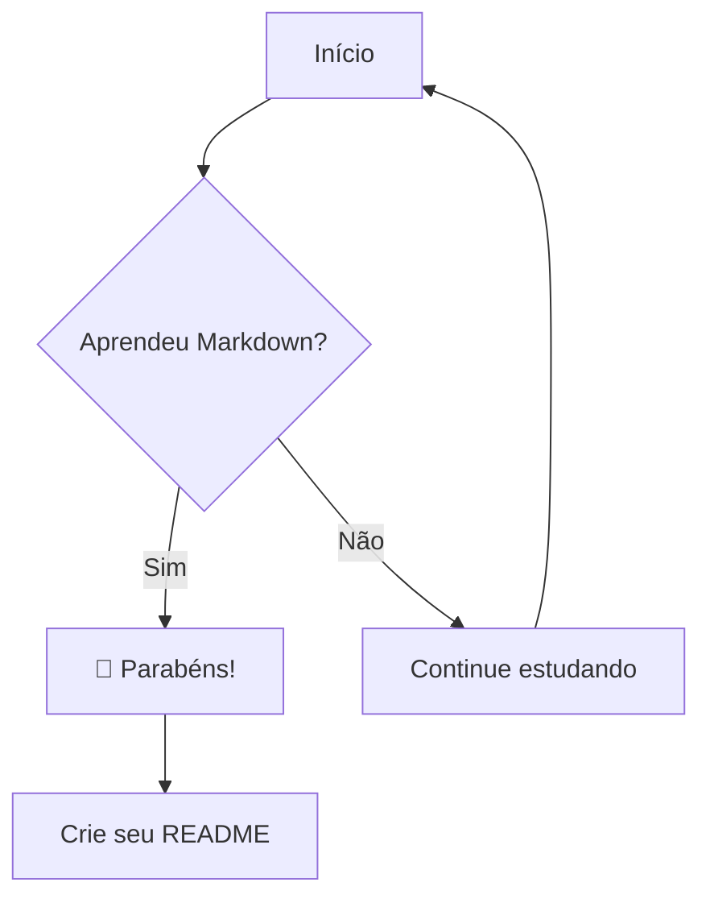

# 📘 Curso Completo de Markdown

> **O guia definitivo** para dominar Markdown do zero ao avançado — com exemplos visuais, dicas práticas e tudo que você precisa para escrever como um profissional no GitHub, Notion, VS Code e muito mais.

---

## 📋 Índice

1. [O que é Markdown?](#-o-que-é-markdown)
2. [Por que usar Markdown?](#-por-que-usar-markdown)
3. [Ferramentas e Editores](#-ferramentas-e-editores)
4. [Módulo 1 — Cabeçalhos](#módulo-1--cabeçalhos)
5. [Módulo 2 — Ênfase e Formatação de Texto](#módulo-2--ênfase-e-formatação-de-texto)
6. [Módulo 3 — Listas](#módulo-3--listas)
7. [Módulo 4 — Links e Imagens](#módulo-4--links-e-imagens)
8. [Módulo 5 — Código](#módulo-5--código)
9. [Módulo 6 — Citações (Blockquotes)](#módulo-6--citações-blockquotes)
10. [Módulo 7 — Tabelas](#módulo-7--tabelas)
11. [Módulo 8 — Linhas Horizontais e Separadores](#módulo-8--linhas-horizontais-e-separadores)
12. [Módulo 9 — Markdown Estendido (GitHub Flavored)](#módulo-9--markdown-estendido-github-flavored)
13. [Módulo 10 — Escrevendo um README Profissional](#módulo-10--escrevendo-um-readme-profissional)
14. [Referência Rápida — Cheatsheet](#-referência-rápida--cheatsheet)
15. [Exercícios Práticos](#-exercícios-práticos)

---

## 🤔 O que é Markdown?

**Markdown** é uma linguagem de marcação leve criada por **John Gruber** em 2004. O objetivo é simples: escrever texto formatado usando uma sintaxe fácil de ler e escrever em forma de texto puro.

```
Texto puro + sintaxe simples → Formatação bonita
```

Em vez de clicar em botões num editor visual (como Word), você escreve símbolos especiais diretamente no texto:

| Você escreve | Você vê |
|---|---|
| `**negrito**` | **negrito** |
| `# Título` | Um grande título |
| `[link](url)` | Um link clicável |

---

## ✅ Por que usar Markdown?

- 🚀 **Rápido** — escreva sem tirar as mãos do teclado
- 📦 **Portátil** — é só texto puro, funciona em qualquer lugar
- 🌐 **Universal** — GitHub, Notion, Discord, Reddit, Slack, VS Code, Obsidian...
- 🔒 **Durável** — arquivos `.md` nunca ficam obsoletos
- 👁️ **Legível mesmo sem renderizar** — ao contrário do HTML
- ⚡ **Rápido de aprender** — você domina o básico em 30 minutos

---

## 🛠️ Ferramentas e Editores

Você pode escrever Markdown em qualquer editor de texto, mas alguns oferecem visualização em tempo real:

| Ferramenta | Plataforma | Melhor para |
|---|---|---|
| **VS Code** | Desktop | Desenvolvimento |
| **Typora** | Desktop | Escrita imersiva |
| **Obsidian** | Desktop/Mobile | Anotações e PKM |
| **StackEdit** | Web | Rascunhos online |
| **HackMD** | Web | Colaboração |
| **GitHub** | Web | READMEs e docs |
| **Notion** | Web/Desktop | Workspaces |

> 💡 **Dica:** No VS Code, pressione `Ctrl+Shift+V` (Windows/Linux) ou `Cmd+Shift+V` (Mac) para abrir a pré-visualização do Markdown ao lado.

---

## Módulo 1 — Cabeçalhos

Os cabeçalhos criam hierarquia no seu documento. Use o símbolo `#` seguido de um espaço.

### Sintaxe

```markdown
# Cabeçalho H1 — Título principal
## Cabeçalho H2 — Seção
### Cabeçalho H3 — Subseção
#### Cabeçalho H4 — Sub-subseção
##### Cabeçalho H5 — Raramente usado
###### Cabeçalho H6 — Muito específico
```

### Resultado

# Cabeçalho H1 — Título principal
## Cabeçalho H2 — Seção
### Cabeçalho H3 — Subseção
#### Cabeçalho H4 — Sub-subseção
##### Cabeçalho H5 — Raramente usado
###### Cabeçalho H6 — Muito específico

---

### Sintaxe Alternativa (apenas H1 e H2)

Você também pode usar a sintaxe de sublinhado:

```markdown
Título Principal
================

Subtítulo
---------
```

> ⚠️ **Regra importante:** Sempre deixe um espaço entre o `#` e o texto. `#Título` não funciona, mas `# Título` funciona!

> 💡 **Boas práticas:**
> - Use apenas **um H1** por documento (geralmente o título)
> - Não pule níveis (não vá de H2 para H4 diretamente)
> - O GitHub gera automaticamente uma âncora de link para cada cabeçalho

---

## Módulo 2 — Ênfase e Formatação de Texto

### Negrito

Use `**dois asteriscos**` ou `__dois underscores__` ao redor do texto:

```markdown
Este texto é **muito importante**.
Este texto também é __muito importante__.
```

**Resultado:** Este texto é **muito importante**.

---

### Itálico

Use `*um asterisco*` ou `_um underscore_`:

```markdown
Este texto está em *itálico*.
Este texto também está em _itálico_.
```

**Resultado:** Este texto está em *itálico*.

---

### Negrito + Itálico

Combine três asteriscos `***`:

```markdown
Este texto é ***negrito e itálico*** ao mesmo tempo.
```

**Resultado:** Este texto é ***negrito e itálico*** ao mesmo tempo.

---

### Tachado (Strikethrough)

Use `~~dois tils~~`:

```markdown
~~Este texto foi riscado.~~
```

**Resultado:** ~~Este texto foi riscado.~~

---

### Código Inline

Use `` `crases` `` para destacar código dentro de um parágrafo:

```markdown
Use o comando `git status` para ver o estado do repositório.
```

**Resultado:** Use o comando `git status` para ver o estado do repositório.

---

### Resumo Visual

| Efeito | Sintaxe | Resultado |
|---|---|---|
| Negrito | `**texto**` | **texto** |
| Itálico | `*texto*` | *texto* |
| Negrito + Itálico | `***texto***` | ***texto*** |
| Tachado | `~~texto~~` | ~~texto~~ |
| Código inline | `` `texto` `` | `texto` |

---

## Módulo 3 — Listas

### Lista Não Ordenada

Use `-`, `*` ou `+` seguido de um espaço:

```markdown
- Maçã
- Banana
- Laranja

* Item com asterisco
* Outro item

+ Item com mais
+ Outro item
```

**Resultado:**
- Maçã
- Banana
- Laranja

---

### Lista Ordenada

Use números seguidos de ponto:

```markdown
1. Primeiro passo
2. Segundo passo
3. Terceiro passo
```

**Resultado:**
1. Primeiro passo
2. Segundo passo
3. Terceiro passo

> 💡 **Curiosidade:** O número que você coloca não importa! O Markdown vai numerar automaticamente. Você pode escrever `1. 1. 1.` e ele vai mostrar `1. 2. 3.`

---

### Listas Aninhadas

Indente com 2 ou 4 espaços para criar sub-listas:

```markdown
- Frutas
  - Cítricas
    - Laranja
    - Limão
  - Tropicais
    - Manga
    - Abacaxi
- Legumes
  - Cenoura
  - Brócolis
```

**Resultado:**
- Frutas
  - Cítricas
    - Laranja
    - Limão
  - Tropicais
    - Manga
    - Abacaxi
- Legumes
  - Cenoura
  - Brócolis

---

### Lista de Tarefas (Task List)

Recurso do GitHub Flavored Markdown (GFM):

```markdown
- [x] Aprender o básico de Markdown
- [x] Entender cabeçalhos e formatação
- [ ] Praticar com tabelas
- [ ] Criar meu primeiro README profissional
- [ ] Compartilhar com a comunidade
```

**Resultado:**
- [x] Aprender o básico de Markdown
- [x] Entender cabeçalhos e formatação
- [ ] Praticar com tabelas
- [ ] Criar meu primeiro README profissional
- [ ] Compartilhar com a comunidade

---

### Misturando Listas

```markdown
1. Configure o ambiente
   - Instale o VS Code
   - Instale a extensão Markdown Preview
2. Crie seu primeiro arquivo
   - Use a extensão `.md`
   - Salve com `Ctrl+S`
3. Visualize o resultado
```

**Resultado:**
1. Configure o ambiente
   - Instale o VS Code
   - Instale a extensão Markdown Preview
2. Crie seu primeiro arquivo
   - Use a extensão `.md`
   - Salve com `Ctrl+S`
3. Visualize o resultado

---

## Módulo 4 — Links e Imagens

### Links Inline

A sintaxe é `[texto do link](URL)`:

```markdown
Visite o [GitHub](https://github.com) para ver seus repositórios.
```

**Resultado:** Visite o [GitHub](https://github.com) para ver seus repositórios.

---

### Links com Título (Tooltip)

Adicione um título entre aspas após a URL:

```markdown
[GitHub](https://github.com "O maior host de código do mundo")
```

Ao passar o mouse sobre o link, o título aparece como tooltip.

---

### Links de Referência

Úteis para reutilizar links ou deixar o texto mais limpo:

```markdown
Acesse o [GitHub][gh] e o [Stack Overflow][so] para aprender mais.

[gh]: https://github.com
[so]: https://stackoverflow.com
```

**Resultado:** Acesse o [GitHub][gh] e o [Stack Overflow][so] para aprender mais.

[gh]: https://github.com
[so]: https://stackoverflow.com

---

### Links Automáticos

URLs e emails entre `< >` viram links automaticamente:

```markdown
<https://github.com>
<contato@email.com>
```

**Resultado:**
<https://github.com>

---

### Imagens

A sintaxe é quase igual à de links, mas com `!` na frente:

```markdown

```

```markdown

```

**Resultado:**


---

### Imagens com Link

Combine imagem e link para criar um clique na imagem:

```markdown
[](https://daringfireball.net/projects/markdown/)
```

**Resultado:**

[](https://daringfireball.net/projects/markdown/)

---

### Badges — Enfeites para READMEs

Badges são imagens geradas automaticamente. Use [shields.io](https://shields.io) para criar os seus:

```markdown


```

---

## Módulo 5 — Código

### Código Inline

Para mencionar código dentro de um parágrafo:

```markdown
A variável `contador` deve ser do tipo `int`.
```

**Resultado:** A variável `contador` deve ser do tipo `int`.

---

### Bloco de Código

Use três crases ` ``` ` para abrir e fechar um bloco:

````markdown
```
function saudacao() {
    console.log("Olá, Markdown!");
}
```
````

**Resultado:**

```
function saudacao() {
    console.log("Olá, Markdown!");
}
```

---

### Realce de Sintaxe (Syntax Highlighting)

Especifique a linguagem logo após as três crases:

````markdown
```python
def saudacao(nome):
    """Exibe uma saudação personalizada."""
    print(f"Olá, {nome}! Bem-vindo ao Markdown.")

saudacao("Dev")
```
````

**Resultado:**

```python
def saudacao(nome):
    """Exibe uma saudação personalizada."""
    print(f"Olá, {nome}! Bem-vindo ao Markdown.")

saudacao("Dev")
```

---

### Exemplos com Várias Linguagens

**JavaScript:**
```javascript
const saudacao = (nome) => {
    return `Olá, ${nome}! 👋`;
};

console.log(saudacao("Mundo"));
```

**HTML:**
```html
<!DOCTYPE html>
<html lang="pt-BR">
  <head>
    <title>Meu Site</title>
  </head>
  <body>
    <h1>Olá, Markdown!</h1>
  </body>
</html>
```

**SQL:**
```sql
SELECT nome, email
FROM usuarios
WHERE ativo = TRUE
ORDER BY nome ASC
LIMIT 10;
```

**Bash:**
```bash
#!/bin/bash
echo "Iniciando o script..."
mkdir -p meu-projeto/src
cd meu-projeto
git init
echo "Projeto criado com sucesso! ✅"
```

---

### Linguagens Suportadas (mais comuns)

| Linguagem | Tag |
|---|---|
| Python | ` ```python ` |
| JavaScript | ` ```javascript ` |
| TypeScript | ` ```typescript ` |
| Java | ` ```java ` |
| C/C++ | ` ```c ` / ` ```cpp ` |
| C# | ` ```csharp ` |
| Go | ` ```go ` |
| Rust | ` ```rust ` |
| PHP | ` ```php ` |
| Ruby | ` ```ruby ` |
| HTML | ` ```html ` |
| CSS | ` ```css ` |
| SQL | ` ```sql ` |
| JSON | ` ```json ` |
| YAML | ` ```yaml ` |
| Bash/Shell | ` ```bash ` |
| Markdown | ` ```markdown ` |
| Dockerfile | ` ```dockerfile ` |

---

## Módulo 6 — Citações (Blockquotes)

Use `>` no início da linha para criar citações:

```markdown
> "A simplicidade é o mais alto grau de sofisticação."
> — Leonardo da Vinci
```

**Resultado:**

> "A simplicidade é o mais alto grau de sofisticação."
> — Leonardo da Vinci

---

### Citações Aninhadas

```markdown
> Nível 1 — Esta é a mensagem original.
>
> > Nível 2 — Esta é uma resposta à mensagem.
> >
> > > Nível 3 — Esta é uma resposta à resposta.
```

**Resultado:**

> Nível 1 — Esta é a mensagem original.
>
> > Nível 2 — Esta é uma resposta à mensagem.
> >
> > > Nível 3 — Esta é uma resposta à resposta.

---

### Citações com Formatação

Você pode usar qualquer elemento Markdown dentro de uma citação:

```markdown
> ### ⚠️ Atenção!
>
> Este é um aviso importante. Certifique-se de:
> - Salvar seu trabalho regularmente
> - Fazer **backup** dos seus dados
> - Testar o código antes de fazer `git push`
```

**Resultado:**

> ### ⚠️ Atenção!
>
> Este é um aviso importante. Certifique-se de:
> - Salvar seu trabalho regularmente
> - Fazer **backup** dos seus dados
> - Testar o código antes de fazer `git push`

---

### Usando Citações como Alertas (GitHub)

O GitHub suporta alertas especiais com ícones:

```markdown
> [!NOTE]
> Informação útil que o usuário deveria saber.

> [!TIP]
> Conselho opcional para facilitar a vida.

> [!IMPORTANT]
> Informação crucial para o sucesso.

> [!WARNING]
> Conteúdo crítico que exige atenção.

> [!CAUTION]
> Consequências negativas de certas ações.
```

**Resultado (no GitHub):**

> [!NOTE]
> Informação útil que o usuário deveria saber.

> [!TIP]
> Conselho opcional para facilitar a vida.

> [!IMPORTANT]
> Informação crucial para o sucesso.

> [!WARNING]
> Conteúdo crítico que exige atenção.

> [!CAUTION]
> Consequências negativas de certas ações.

---

## Módulo 7 — Tabelas

Tabelas são criadas com `|` (pipe) para separar colunas e `-` para o cabeçalho:

### Sintaxe Básica

```markdown
| Coluna 1 | Coluna 2 | Coluna 3 |
|----------|----------|----------|
| Dado A   | Dado B   | Dado C   |
| Dado D   | Dado E   | Dado F   |
```

**Resultado:**

| Coluna 1 | Coluna 2 | Coluna 3 |
|----------|----------|----------|
| Dado A   | Dado B   | Dado C   |
| Dado D   | Dado E   | Dado F   |

---

### Alinhamento de Colunas

Use `:` nos separadores para controlar o alinhamento:

```markdown
| Esquerda | Centro   | Direita  |
|:---------|:--------:|---------:|
| texto    | texto    | texto    |
| 100      | 100      | 100      |
| longo    | médio    | ok       |
```

**Resultado:**

| Esquerda | Centro   | Direita  |
|:---------|:--------:|---------:|
| texto    | texto    | texto    |
| 100      | 100      | 100      |
| longo    | médio    | ok       |

---

### Tabelas com Formatação

Você pode usar Markdown dentro das células:

```markdown
| Recurso         | Suporte | Descrição                     |
|-----------------|:-------:|-------------------------------|
| **Negrito**     | ✅      | `**texto**` ou `__texto__`    |
| *Itálico*       | ✅      | `*texto*` ou `_texto_`        |
| ~~Tachado~~     | ✅      | `~~texto~~`                   |
| `Código inline` | ✅      | Crases ao redor do texto      |
| Imagens         | ✅      | ``                 |
| Links           | ✅      | `[texto](url)`                |
| Tabelas anin.   | ❌      | Não suportado nativo          |
```

**Resultado:**

| Recurso         | Suporte | Descrição                     |
|-----------------|:-------:|-------------------------------|
| **Negrito**     | ✅      | `**texto**` ou `__texto__`    |
| *Itálico*       | ✅      | `*texto*` ou `_texto_`        |
| ~~Tachado~~     | ✅      | `~~texto~~`                   |
| `Código inline` | ✅      | Crases ao redor do texto      |
| Imagens         | ✅      | ``                 |
| Links           | ✅      | `[texto](url)`                |
| Tabelas anin.   | ❌      | Não suportado nativo          |

> 💡 **Dica:** Use a extensão **Markdown Table** no VS Code para formatar tabelas automaticamente. Ou o site [tableconvert.com](https://tableconvert.com) para criar tabelas visualmente.

---

## Módulo 8 — Linhas Horizontais e Separadores

Use três ou mais `-`, `*` ou `_` em uma linha vazia para criar uma linha horizontal:

```markdown
---

***

___
```

**Resultado:** (os três produzem o mesmo visual)

---

> 💡 **Dica:** Deixe sempre uma linha em branco antes e depois do separador para evitar que o Markdown interprete o texto acima como um cabeçalho H2.

---

## Módulo 9 — Markdown Estendido (GitHub Flavored)

O **GitHub Flavored Markdown (GFM)** adiciona recursos extras ao Markdown padrão:

### 1. Menções a Usuários e Issues

```markdown
Ótimo trabalho, @username! 🎉

Isso resolve o problema descrito em #42.
```

> Funciona apenas dentro do GitHub — cria links automáticos para perfis e issues.

---

### 2. Autolinks

O GitHub converte automaticamente URLs em links:

```markdown
Acesse https://github.com para ver seu perfil.
```

---

### 3. Emojis 🎉

O GitHub suporta emojis com a sintaxe `:nome-do-emoji:`:

```markdown
Ótimo trabalho! :tada: :rocket: :heart:
Cuidado! :warning: :x: :stop_sign:
Informação: :bulb: :information_source: :memo:
```

**Resultado:** 🎉 🚀 ❤️ ⚠️ ❌ 🛑 💡 ℹ️ 📝

> 🔍 Lista completa de emojis: [github.com/ikatyang/emoji-cheat-sheet](https://github.com/ikatyang/emoji-cheat-sheet)

---

### 4. Detalhes/Sumário (HTML dentro do Markdown)

O GitHub suporta tags HTML básicas:

```markdown
<details>
<summary>📦 Clique para expandir</summary>

Conteúdo oculto aqui! Pode conter qualquer Markdown:

- Item 1
- Item 2

```python
print("Código secreto!")
```

</details>
```

**Resultado:**

<details>
<summary>📦 Clique para expandir</summary>

Conteúdo oculto aqui! Pode conter qualquer Markdown:

- Item 1
- Item 2

```python
print("Código secreto!")
```

</details>

---

### 5. Notas de Rodapé

```markdown
Aqui está uma afirmação importante[^1] com uma referência[^nota].

[^1]: Esta é a primeira nota de rodapé.
[^nota]: Esta nota tem um nome descritivo.
```

**Resultado:**

Aqui está uma afirmação importante[^1] com uma referência[^nota].

[^1]: Esta é a primeira nota de rodapé.
[^nota]: Esta nota tem um nome descritivo.

---

### 6. Definições (mermaid diagrams)

O GitHub renderiza diagramas escritos em Mermaid:

````markdown

````

**Resultado (no GitHub):**


---

### 7. HTML dentro do Markdown

Quando o Markdown não é suficiente, use HTML:

```markdown
<div align="center">
  <h2>Texto centralizado com HTML</h2>
  <p>O Markdown não suporta alinhamento nativo, mas HTML sim!</p>
</div>
```

<div align="center">
  <h2>Texto centralizado com HTML</h2>
  <p>O Markdown não suporta alinhamento nativo, mas HTML sim!</p>
</div>

---

## Módulo 10 — Escrevendo um README Profissional

O **README.md** é a vitrine do seu projeto no GitHub. Um bom README pode fazer toda a diferença!

### Estrutura Recomendada

```markdown
# 🚀 Nome do Projeto

> Descrição curta e impactante do projeto em uma linha.

[](LICENSE)
[]()

## 📋 Sobre

Descrição mais detalhada do projeto. O que ele faz? Qual problema resolve?
Para quem é útil?

## ✨ Funcionalidades

- ✅ Funcionalidade 1
- ✅ Funcionalidade 2
- 🚧 Funcionalidade em desenvolvimento
- 📋 Funcionalidade planejada

## 🔧 Tecnologias

- [Node.js](https://nodejs.org)
- [React](https://reactjs.org)
- [MongoDB](https://mongodb.com)

## 🚀 Como Começar

### Pré-requisitos

- Node.js >= 18.0
- npm ou yarn

### Instalação

```bash
# Clone o repositório
git clone https://github.com/seu-usuario/seu-projeto.git

# Entre no diretório
cd seu-projeto

# Instale as dependências
npm install

# Inicie o servidor de desenvolvimento
npm run dev
```

## 📖 Uso

Explique como usar o projeto com exemplos práticos.

## 🤝 Contribuindo

Contribuições são bem-vindas! Leia o [CONTRIBUTING.md](CONTRIBUTING.md).

## 📄 Licença

Este projeto está sob a licença MIT. Veja o arquivo [LICENSE](LICENSE).

## 📧 Contato

Seu Nome — [@seu_twitter](https://twitter.com/seu_twitter) — email@exemplo.com
```

---

### Dicas para um README de Destaque

| Dica | Por quê? |
|------|----------|
| 🖼️ Adicione um screenshot ou GIF | Imagens valem mais que mil palavras |
| 📊 Use badges relevantes | Mostram status, versão, cobertura de testes |
| 🔗 Links para demo ao vivo | Permite testar sem instalação |
| 📋 Mantenha atualizado | README desatualizado passa má impressão |
| 🌍 Considere tradução | Inglês alcança mais pessoas |
| 📑 Crie um índice | Facilita navegação em docs longos |

---

## 🚀 Referência Rápida — Cheatsheet

```markdown
# H1     ## H2     ### H3     #### H4     ##### H5     ###### H6

**negrito**   __negrito__
*itálico*     _itálico_
***negrito e itálico***
~~tachado~~
`código inline`

- item não ordenado    * item    + item
1. item ordenado       2. segundo

- [x] tarefa feita
- [ ] tarefa pendente

[texto do link](https://url.com)
[texto][referencia]   [referencia]: https://url.com
<https://url.com>


```linguagem
bloco de código
```

> citação
>> citação aninhada

| Col 1 | Col 2 | Col 3 |
|-------|:-----:|------:|
| esq   | cen   | dir   |

---   ***   ___

<details><summary>Resumo</summary>Conteúdo</details>

Texto com nota[^1]
[^1]: Texto da nota de rodapé
```

---

## 📝 Exercícios Práticos

Praticar é a melhor forma de aprender! Complete os exercícios abaixo:

---

### 🟢 Exercício 1 — Nível Iniciante

Crie um arquivo `sobre-mim.md` com:

- [ ] Um H1 com seu nome
- [ ] Um H2 chamado "Sobre mim" com um parágrafo descritivo
- [ ] Uma lista com suas 3 linguagens de programação favoritas
- [ ] Um link para seu GitHub

<details>
<summary>👁️ Ver solução</summary>

```markdown
# João Silva

## Sobre mim

Sou desenvolvedor web apaixonado por tecnologia e café ☕.
Adoro aprender coisas novas e compartilhar conhecimento.

## Minhas linguagens favoritas

1. Python
2. JavaScript
3. Go

## Onde me encontrar

Acesse meu perfil no [GitHub](https://github.com/joaosilva)!
```

</details>

---

### 🟡 Exercício 2 — Nível Intermediário

Crie um `CHANGELOG.md` com:

- [ ] Título principal
- [ ] Três versões como H2 (ex: `## [1.2.0] - 2024-01-15`)
- [ ] Para cada versão, sublistas: `### Adicionado`, `### Corrigido`, `### Removido`
- [ ] Use **negrito** para destacar mudanças importantes
- [ ] Use ~~tachado~~ para itens descontinuados

<details>
<summary>👁️ Ver solução</summary>

```markdown
# Changelog

## [1.2.0] - 2024-03-10

### Adicionado
- **Nova tela de dashboard** com gráficos interativos
- Suporte a exportação em PDF
- Modo escuro 🌙

### Corrigido
- Bug no login com Google OAuth
- Performance melhorada em 40% na página inicial

### Removido
- ~~Suporte ao Internet Explorer~~ (oficialmente descontinuado)

---

## [1.1.0] - 2024-02-01

### Adicionado
- Sistema de notificações em tempo real
- API REST documentada

### Corrigido
- Crash ao fazer upload de arquivos grandes

---

## [1.0.0] - 2024-01-15

### Adicionado
- **Lançamento inicial** do projeto! 🎉
- Autenticação de usuários
- CRUD básico de produtos
```

</details>

---

### 🔴 Exercício 3 — Nível Avançado

Crie um `README.md` completo para um projeto fictício chamado **"TaskFlow"** — um app de gerenciamento de tarefas. Inclua:

- [ ] Badges de status
- [ ] Screenshot (pode ser um link qualquer de imagem)
- [ ] Seção de funcionalidades com emojis
- [ ] Instruções de instalação com blocos de código
- [ ] Tabela comparando planos Free vs Pro
- [ ] Seção `<details>` com FAQ
- [ ] Lista de tarefas para o roadmap

<details>
<summary>👁️ Ver solução</summary>

```markdown
# ⚡ TaskFlow

> Gerencie suas tarefas com eficiência e clareza.

[]()
[]()
[]()

## 📸 Preview


## ✨ Funcionalidades

- 🗂️ **Organização por projetos** — separe tarefas por contexto
- 🏷️ **Tags e categorias** — encontre tudo rapidamente
- 📅 **Prazos e lembretes** — nunca perca um deadline
- 👥 **Colaboração em equipe** — compartilhe projetos
- 📊 **Dashboard analítico** — acompanhe seu progresso
- 🌙 **Modo escuro** — para trabalhar à noite

## 🚀 Instalação

```bash
# Clone o repositório
git clone https://github.com/exemplo/taskflow.git
cd taskflow

# Instale as dependências
npm install

# Configure as variáveis de ambiente
cp .env.example .env

# Inicie a aplicação
npm start
```

## 💎 Planos

| Recurso            | Free | Pro |
|--------------------|:----:|:---:|
| Projetos           | 3    | ∞   |
| Tarefas por projeto| 50   | ∞   |
| Colaboradores      | 1    | 10  |
| Armazenamento      | 1 GB | 50 GB|
| Suporte            | ❌   | ✅  |
| **Preço/mês**      | Grátis | R$ 29,90 |

## 🗺️ Roadmap

- [x] MVP com CRUD básico
- [x] Autenticação de usuários
- [x] Integração com Google Calendar
- [ ] App mobile (iOS/Android)
- [ ] Integração com Slack
- [ ] IA para sugestão de prioridades

## ❓ FAQ

<details>
<summary>O TaskFlow funciona offline?</summary>

Sim! Utilizamos Service Workers para cache offline.
As alterações são sincronizadas quando a conexão é restabelecida.

</details>

<details>
<summary>Meus dados são seguros?</summary>

Absolutamente. Utilizamos criptografia AES-256 para todos
os dados em repouso e TLS 1.3 para dados em trânsito.

</details>

## 📄 Licença

MIT © [Exemplo Corp](https://github.com/exemplo)
```

</details>

---

## 🎓 Próximos Passos

Parabéns por chegar até aqui! Agora você tem uma base sólida em Markdown. Para continuar evoluindo:

1. **Pratique diariamente** — escreva suas anotações em Markdown
2. **Contribua para projetos open source** — melhore documentação existente
3. **Crie seu perfil GitHub** — o arquivo `README.md` na raiz do seu usuário vira sua bio!
4. **Explore ferramentas avançadas** — Pandoc (converte MD para PDF/DOCX), MkDocs, Docusaurus
5. **Aprenda Mermaid** — crie diagramas diretamente no Markdown

---

## 📚 Recursos Adicionais

| Recurso | Link | Descrição |
|---------|------|-----------|
| Documentação oficial | [daringfireball.net](https://daringfireball.net/projects/markdown/) | A especificação original |
| GitHub GFM | [github.com/docs](https://docs.github.com/pt/get-started/writing-on-github) | Guia oficial do GitHub |
| CommonMark | [commonmark.org](https://commonmark.org) | Especificação padronizada |
| Markdown Guide | [markdownguide.org](https://www.markdownguide.org) | Guia completo e moderno |
| Shields.io | [shields.io](https://shields.io) | Gerador de badges |
| Emoji Cheatsheet | [emoji-cheat-sheet](https://github.com/ikatyang/emoji-cheat-sheet) | Todos os emojis do GitHub |
| Mermaid | [mermaid.js.org](https://mermaid.js.org) | Diagramas em Markdown |
| Table Generator | [tableconvert.com](https://tableconvert.com) | Gerador de tabelas |

---

<div align="center">

**Feito com ❤️ e muito Markdown**

*"A melhor documentação é aquela que existe."*

⭐ Se este curso te ajudou, dê uma estrela no repositório!

</div>
